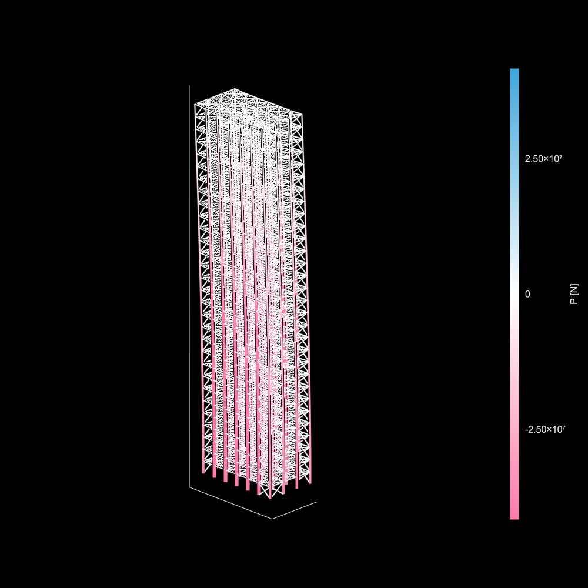

[](https://zenodo.org/doi/10.5281/zenodo.10581559)


# Asap.jl
Asap is...
- the anti-SAP (2000)
- results as Soon As Possible
- another Structural Analysis Package

Designed first-and-foremost for information-rich data structures and ease of querying, but always with performance in mind.

See also: [AsapToolkit](https://github.com/keithjlee/AsapToolkit), [AsapOptim](https://github.com/keithjlee/AsapOptim), [AsapHarmonics](https://github.com/keithjlee/AsapHarmonics).

# Installation
Asap.jl is now a registered Julia package. Install through package mode in the REPL:
```julia
pkg> add Asap
```
or
```julia
using Pkg
Pkg.Add("Asap")
```

## Citing
When using or extending this software for research purposes, please cite using the following:

### Bibtex
```
@software{lee_2024_10581560,
  author       = {Lee, Keith Janghyun},
  title        = {Asap.jl},
  month        = jan,
  year         = 2024,
  publisher    = {Zenodo},
  version      = {v0.1},
  doi          = {10.5281/zenodo.10581560},
  url          = {https://doi.org/10.5281/zenodo.10581560}
}
```

### Other styles
Or find a pre-written citation in the style of your choice [here](https://zenodo.org/records/10724610) (see the Citation box on the right side). E.g., for APA:
```
Lee, K. J. (2024). Asap.jl (v0.1). Zenodo. https://doi.org/10.5281/zenodo.10581560
```

# Overview
The primary information object is the  `Model` data structure, that is constructed from a vector of `Node`s, `Element`s and `Load`s. Model nodes contain 6 DOF by default; for convenience, a subtype `TrussModel` (`TrussNode`, `TrussElement`) for large truss analysis is also provided. The following provides a quick overview of the general taxonomy and workflow.

## `Node`
Nodes are the sole information holders for FEA: boundary conditions and loads are expressed through nodes, and elemental forces and moments are interpolated from the displacements of end nodes. They are constructed as follows:

```julia
node1 = Node(position::Vector{Real}, dofs::Vector{Bool})
node2 = Node(position::Vector{Real}, fixity::Symbol)
```

`node1` is constructed by providing its spatial position in XYZ coordinates and a vector of booleans that denote the activity of each degree of freedom, where `true` means that the DOF is free to move. The DOFs are in the following order:
- Translation in X
- Translation in Y
- Translation in Z
- Rotation about X
- Rotation about Y
- Rotation about Z

`node2` is constructed by providing a position and a *common boundary condition symbol*. The following are available:
- `:free` All degrees of freedom are active
- `:fixed` All degrees of freedom are fixed in place
- `:pinned` All translational degrees of freedom are fixed
- `:x/y/zfixed` All degrees of freedom are active with the exception of x/y/z (choose one axis)
- `:x/y/zfree` All degrees of freedom are fixed with the exception of x/y/z

Nodes that are part of the same model should be collected into a single vector:

```julia
nodes = [node1, node2]
```

## `Element`
Elements bridge the gap between nodes and govern the displacement relationships via its material and geometric properties (stiffness). They are defined by its start and end nodes, the cross sectional properties, and the DOF releases.

### `Material`/`Section`
An element must be assigned a cross section `Section` that contains all geometric and material information necessary for analysis. A material can be constructed via:

```julia
material = Material(E::T, G::T, ρ::T, ν::T) where T <: Real
```

Where:
- E: Young's Modulus \[Force/Distance^2]
- G: Shear Modulus \[Force/Distance^2]
- ρ: Weight Density \[Force/Distance^3]
- ν: Poisson's Ration \[Unitless]

**It is up to you to ensure consistency of units**. For convenience, steel material properties are provided in two units as: `Steel_Nmm` and `Steel_kNm`.

A cross section includes both material and geometric information, and is constructed by:
```julia
section1 = Section(material::Material, A::T, Ix::T, Iy::T, J::T) where T <: Real
section2 = Section(A::T, E::T, G::T, Ix::T, Iy::T, J::T) where T <: Real
```
Where:
- `material` is a `Material` structure
- A: cross sectional area \[Distance^2]
- Ix: moment of inertia of primary bending axis \[Distance^4]
- Iy: moment of inertia of secondary (orthogonal) bending axis \[Distance^4]

The definition of a `Material` can be bypassed by explicitly providing material properties via the first method.

An `Element` can now be created via:
```julia
element1a = Element(nodes::Vector{Node}, nodeIndex::Vector{Int64}, section::Section)
element1b = Element(nodes::Vector{Node}, nodeIndex::Vector{Int64}, release::Symbol)

element2a = Element(nodeStart::Node, nodeEnd::Node, section::Section)
element2b = Element(nodeStart::Node, nodeEnd::Node, section::Section, release::Symbol)
```

The first two methods uses the indices of the start and end node in the previously collected vector of nodes. The second method directly inputs the starting and end nodes. Methods `a` assumed that the element end DOFs are rigidly coupled to the DOF of the end nodes. Methods `b` provides option for decoupling a subset of rotational DOFs and one or both ends of the element. The options are:
- `:fixedfixed` Default
- `:freefixed` Decoupled at the starting node
- `:fixedfree` Decoupled at ending node
- `freefree` Decoupled at both nodes
- `:joist` Decoupled at both nodes *with the exception of torsional stiffness*

You can also set the angle of roll of the cross section with respect to the element local X axis via:
```julia
element.Ψ = pi/3
```
The angle is in radians, and is set to `pi/2` by default: this generally ensures that the local primary bending axis is aligned with the XY plan, IE the element is oriented in the 'correct' way with respect to gravity loading. Once one or more elements are defined, they should also be collected in a vector:
```julia
elements = [element1a]
```

## `Load`
Loads can now be defined via the following options:

### `NodeForce`
Define a point load acting at a node in the global X,Y,Z axes \[Force, Force, Force]
```julia
NodeForce(node::Node, value::Vector{<:Real})
```

### `NodeMoment`
Define a moment acting at a node in the global X,Y,Z axes \[Force×Distance, Force×Distance, Force×Distance]
```julia
NodeMoment(node::Node, value::Vector{<:Real})
```

### `LineLoad`
Define a uniformly distributed load acting on an element in the global X,Y,Z axes \[Force/Distance, Force/Distance, Force/Distance]
```julia
LineLoad(element::Element, value::Vector{<:Real})
```

### `PointLoad`
Define a point load acting on an element at a parameterized (from 0 to 1) distance from the starting node in the global X,Y,Z axes \[Force, Force, Force]
```julia
PointLoad(element::Element, position::Float64, value::Vector{<:Real})
```

Define as many loads as you like, and collect them in a vector:
```julia
loads = [load1, load2, ...]
```

## `Model`
A model can now be assembled via:
```julia
model = Model(nodes, elements, loads)
```
The structure can be then be analyzed via:
```julia
solve!(model)
```

The following fields are now populated once `solve!` is run:
### For `Node`s
- `node.displacement` all displacements for the given node
- `node.reaction` the induced external force from fixed DOFs (if applicable)

### For `Element`s
- `element.forces` end forces in **LOCAL COORDINATE SYSTEM**
  - Convert to GCS via `element.R' * element.forces`
  
### For `Model`
- `model.u` the complete displacement vector of the system
- `model.S` the global stiffness vector
- `model.compliance` the strain energy of the system


## Small example
```julia
#define nodes
n1 = Node([0., 0., 0.], :free)
n2 = Node([-240., 0., 0.], :fixed)
n3 = Node([0., -240., 0.], :fixed)
n4 = Node([0., 0., -240.], :fixed)

#collect nodes
nodes = [n1, n2, n3, n4]

#define section/material properties and create a section
E = 29e3
G = 11.5e3 
A = 32.9
Iz = 716.
Iy = 236.
J = 15.1

sec = Section(A, E, G, Iz, Iy, J)

#define elements
e1 = Element(nodes, [2,1], sec)
e2 = Element(nodes, [3,1], sec)
e3 = Element(nodes, [4,1], sec)
e3.Ψ = pi/6

#collect elements
elements = [e1, e2, e3]

#define loads
l1 = LineLoad(e1, [0., -3/12, 0.])
l2 = NodeMoment(n1, [-150. * 12, 0., 150. * 12])

#collect loads
loads = [l1, l2]

#assemble model
model = Model(nodes, elements, loads)

#solve model
solve!(model)

#extract information
@show model.u
@show e1.forces
@show n2.reaction

```


## Truss models
Generally the definition of a truss model is the same as above, but using `TrussNode`, `TrussElement`, and `TrussModel`, with the exception that **only** `NodeForce` loads are allowed. Other small details:
- A reduced-information section can be defined via `TrussSection`, where only the area `A` and material stiffness `E` is required: `TrussSection(A::Real, E::Real)`
- There is no end-release option for truss models (they are by definition always `:freefree`)

## 2D analysis
A 2D analysis can be performed by simply fixing all nodal DOFs that would enable out-of-plane displacement. This is provided via:
```julia
planarize!(model; plane = :XY)
```
By default, it assumes that the active plane is Global XY. Your options are: `:XY`, `:YZ`, `:ZX`

# Advanced/More methods
`aSAP` provides a comprehensive suite of utility functions and extension to base methods for easy querying.

## Passed by reference
Note that all objects and their fields are passed by reference, meaning:
```julia
nodes = [node1, ...]
elements = [element1, ...]
loads = [load1, ...]

model = Model(nodes, elements, loads)
solve!(model)

model.elements[1].forces == element1.forces # true
```

## `nodeID`, `elementID`
When a model is processed, all nodes, elements, and loads are given an integer identifier `node.nodeID`, `element.elementID`, `load.loadID` in order of their appearance. This becomes critical for `BridgeElement`s (see below).

## `id`
All nodes, elements, and loads have a mutable field called `id` which is set to `nothing` by default, but can accept a `Symbol` type to group objects together.

```julia

nodegroup1 = [Node(...) for _ = 1:100]
for node in nodegroup1 node.id = :group1 end

nodegroup2 = [Node(...) for _ = 1:100]
for node in nodegroup2 node.id = :group2 end

nodes = [nodegroup1; nodegroup2]

elementgroup1 = [Element(...) for _ = 1:400]
for element in elementgroup1 element.id = :A end

elementgroup2 = [Element(...) for _ = 1:20]
for element in elementgroup2 element.id = :B end

elements = [elementgroup1; elementgroup2; ...]

verticalLoads = [load1, ...]
for load in verticalLoads load.id = :gravity end

horizontalLoads = [load6, ...]
for load in horizontalLoads load.id = :wind end

loads = [verticalLoads; horizontalLoads]

Model = (nodes, elements, loads)
solve!(model)
```

Indexing of node/element collections and index searching is possible through IDs:
```julia
group1displacements = getproperty.(model.nodes[:group1], :displacement)

BelementIndices = findall(model.elements, :B)
```

## `Node` utilities
### `fixnode!`
Change the DOF activity of a node to a different common boundary condition:
```julia
fixnode!(node, :zfixed)
```

## `Element` utilities
### `release!`
Change the end coupling releases of an element:
```julia
release!(element, :joist)
```

### `endpoints`
Get the XYZ positions of the start and end points of an element:
```julia
pends = endpoints(element)
```

### `midpoint`
Get the XYZ position of the midpoint of an element:
```julia
pmid = midpoint(element)
```

## `Model` utilities
### `solve!(model, loadset)`
Solve for the displacements of the same model with respect to a different set of loads without reprocessing heavy computations (stiffness matrix assembly):
```
newloads = [load1, load2, load3, ...]

displacements = solve(model, newloads)

solve!(model, newloads)
```

`solve` simply returns the new global displacement vector `u`, but does not assign new values to loads and elements.

`solve!` updates displacements, forces, reactions, etc. It treats the new load set as if it were the original set. It replaces `model.loads` with the new load set.

### `update_DOF!`
Sometimes the activity of your nodes might change under the same loading conditions. Instead of redefining a new model simply:
```julia
for node in model.nodes[:groupA]
    fixnode!(node, :xfree)
end

update_DOF!(model)
solve!(model)
```

### Reprocessing
Sometimes, you want to start fresh: clear all post-processed values (displacements, forces), reassemble the stiffness matrix, etc. Simply:
```julia
solve!(model; reprocess = true)
```

### `connectivity`
Extract the connectivity matrix `C` of a model via:
```julia
C = connectivity(model::Model)
```

C is a \[nElements × nNodes] sparse matrix where for a given row (element) `-1` is assigned to the column corresponding to the starting node, and `1` is assigned to the ending column.

## `BridgeElement`
Sometimes, it makes sense to define an `Element` *between* two other elements rather than between nodes, IE defining a set of joists that bridge between two parallel primary beams. This can be done via the `BridgeElement`:
```julia
BridgeElement(elementStart::Element, posStart::Float64, elementEnd::Element, posEnd::Float64, section::Section, release::Symbol)
```
The section and release inputs are as before. However, the start and end points are defined by their corresponding `Element` and the *parameterized (0 to 1) position from the starting node of that element*. IE:
```julia
e1 = Element(...)
e2 = Element(...)

girders = [e1, e2]

joists = [BridgeElement(e1, x, e2, x, section, :joist) for x in range(0.1, 0.9, 5)]
for joist in joists joist.id = :bridge end

elements = [girders; joists]

...

model = Model(nodes, elements, loads)
```
Generates a new bridge element that spans from the *midpoint* of `e1` to the *quarter point* of `e2`.

### NOTE:
Since by definition all elements *must* be defined between nodes, the pre-processing step deconstructs all elements and generates new element use of `BridgeElement`s causes the preprocessing step to generate new nodes and elements for assembly:
- `BridgeElement`s are not explicitly used in the model: they are converted to `Element`s
- new `Node`s are created wherever bridges touch an element
- any element that supports a bridge is deleted and replaced with two new elements that span from the initial start node, the newly created bridge node, and the initial end node

This means that the reliance on pass-by-reference for extracting element-wise properties is no longer advised. However, whenever two new elements are generated from an original element that was bridged, they *retain the same* `element.elementID`. IE it is possible to determine which sets of elements are part of the same physical element by their shared `elementID`.

Note that the original `element.id` is also transferred to all new sub-elements, allowing them to be easily extracted. 



# Extensions, Related packages
See [AsapToolkit.jl](https://github.com/keithjlee/AsapToolkit) for even more utility and post-processing functions.