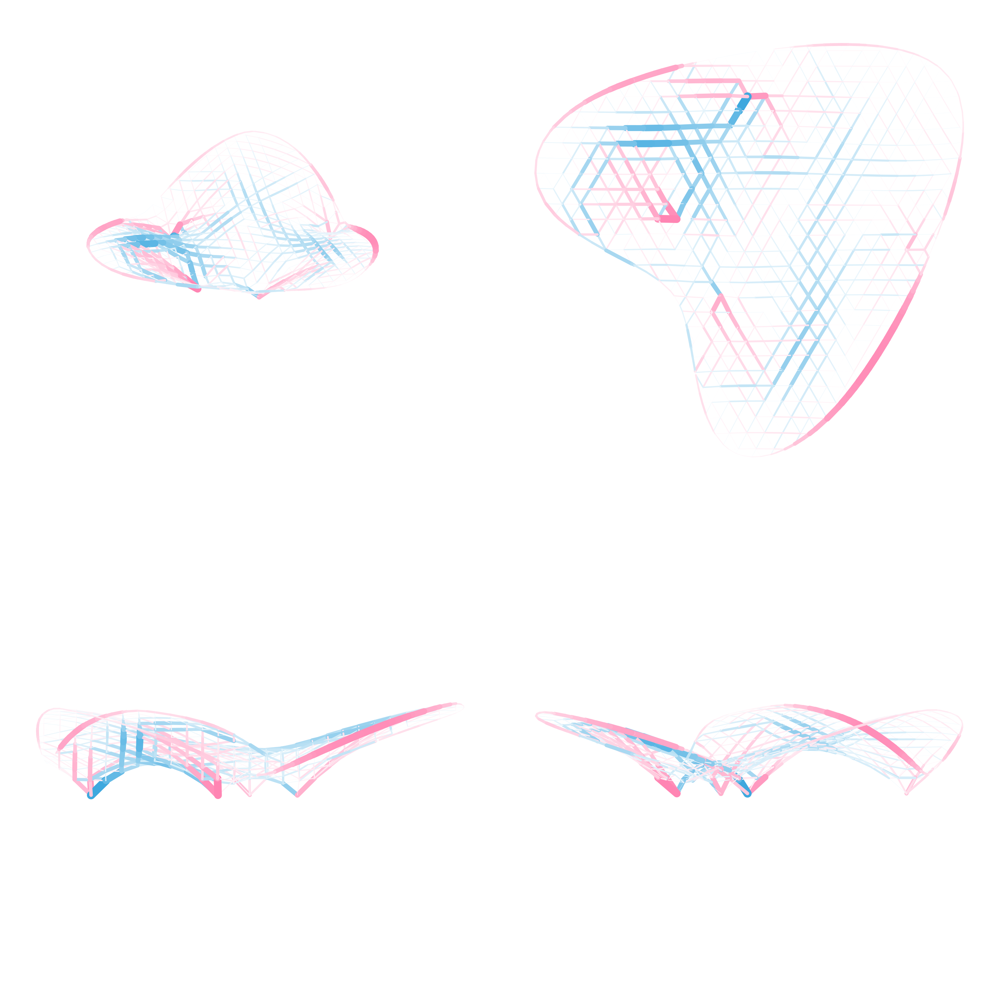

# Asap: Another structural analysis package

For when you want to know what's going on in your structure as soon as possible.

Designed for ease of information extraction. Currently supports 2D/3D truss/frame elements.

