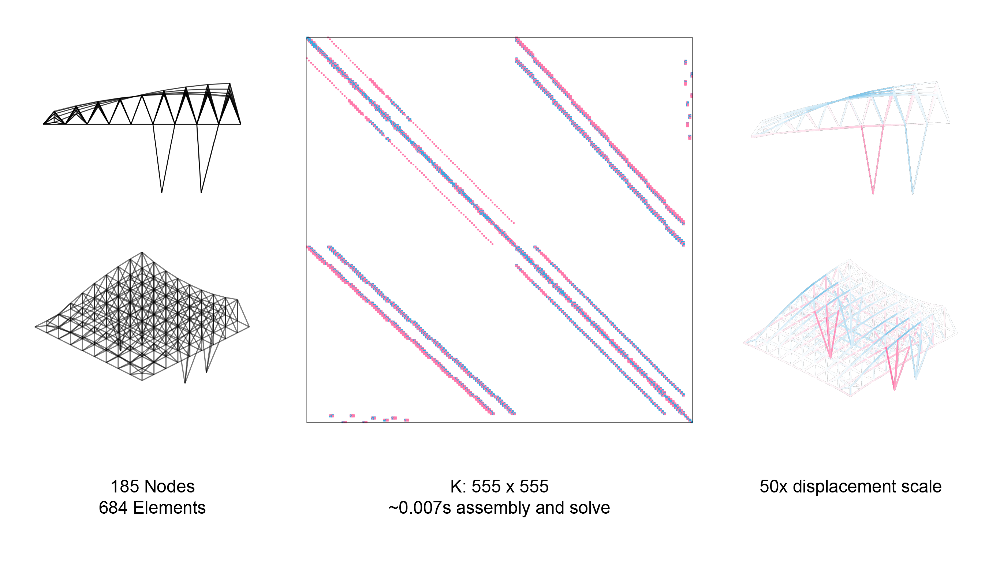
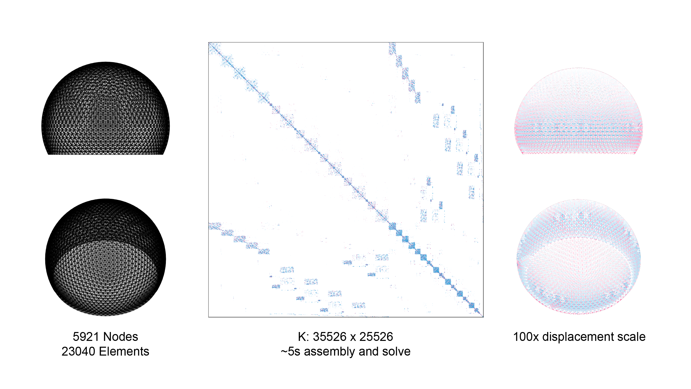

# aSAP: (another) Structural Analysis Package

For when you want to know what's going on in your structure as soon as possible. Designed for ease of querying, performance, and information-rich data structures.

Below is a truss model of moderate scale (~684 elements), parsed and analyzed in 7ms.


Below is a much more complex frame model (~23040 elements), parsed and analyzed in under 5s.


Note that these times are extreme upper bounds, where the structure of the sparse stiffness matrix is yet unknown. Subsequent solves to new external forces are ~.1ms and ~.2s respectively.

A small 3D frame example:

```julia
#define nodes
n1 = Node([0., 0., 0.], :free)
n2 = Node([-240., 0., 0.], :fixed)
n3 = Node([0., -240., 0.], :fixed)
n4 = Node([0., 0., -240.], :fixed)

#collect nodes
nodes = [n1, n2, n3, n4]

#define section/material properties and create a section
E = 29e3
G = 11.5e3 
A = 32.9
Iz = 716.
Iy = 236.
J = 15.1

sec = Section(A, E, G, Iz, Iy, J)

#define elements
e1 = Element(nodes, [2,1], sec)
e2 = Element(nodes, [3,1], sec)
e3 = Element(nodes, [4,1], sec)
e3.Ψ = pi/6

#collect elements
elements = [e1, e2, e3]

#define loads
l1 = LineLoad(e1, [0., -3/12, 0.])
l2 = NodeMoment(n1, [-150. * 12, 0., 150. * 12])

#collect loads
loads = [l1, l2]

#assemble model
model = Model(nodes, elements, loads)

#solve model
solve!(model)

#extract information
println(model.displacements)
println(e1.forces)
println(n2.reaction)

```